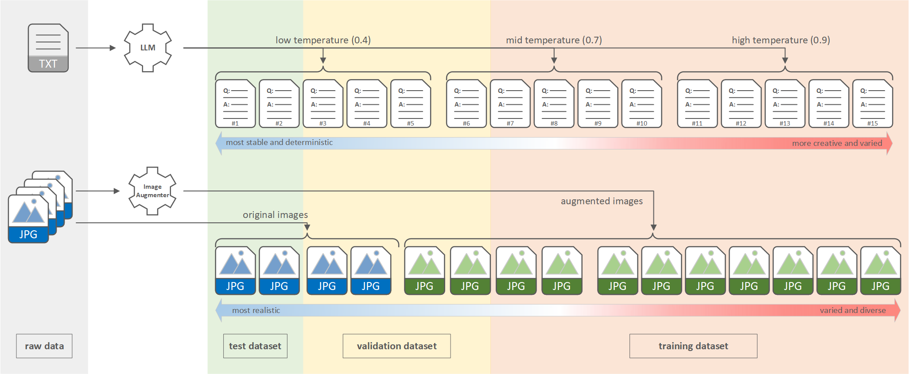

# Synthetic Data Creation
---
## 1. Synthetic Data Creation Overview

The goal of this project is to fine-tune a multi-modal model specifically designed for museum touring scenarios. The fine-tuned model will act as an intelligent museum docent with specialized knowledge about exhibits. It interacts with visitors and provides educational content about exhibitions. When a visitor submits an exhibit image and asks a question, our "museum docent" (the fine-tuned vision LLM) generates a detailed response. This response may include a comprehensive description of the exhibit, its historical significance, or its social impact.

For this project, we leverage exhibition information from the Smithsonian Institution ([si.edu](https://www.si.edu)) to fine-tune a multi-modal model. However, the raw materials (text + images) retrieved from the Smithsonian Institution are not directly suitable for the fine-tuning process. Instead, from the raw materials, we need to generate synthetic data and build a Hugging Face (HF) dataset, in which each data sample comprises a user query image, a user question, and a museum docent's response. In addition, this HF dataset is divided into three splits:  
- train split: used for model training  
- validation split: used for training time loss evaluation  
- test split: used for post-training testing  

The overall workflow to create a HF dataset from raw materials is illustrated below:

## 2. Synthetic Data Creation Workflow

#### 2.1 Image Augmentation

The first step in synthetic data creation is to augment exhibition images for the dataset, as some exhibitions have fewer than the required 15 images from the data source—the Smithsonian Institution ([si.edu](https://www.si.edu)).

In this step, we use the image augmentation tool ([Albumentations](https://albumentations.ai/)) to generate additional images for exhibitions that lack sufficient images. If an exhibit has fewer than 15 original images from the data source, we select some of the original images and generate 20 augmented images for each. This ensures that in the next step, we can form a complete set of 15 images for each exhibit by combining the original and augmented images.

For detailed implementation of this step, please refer to the [Image Augmentation Notebook](./1.1_image_augmentation/image_augmentation.ipynb).

#### 2.2 Raw Dataset Creation

In this step, we assemble a raw dataset (`smithsonian_raw_data.csv`). In this dataset, each row represents one exhibit and contains the exhibit's `id`, `name`, `source link`, `image files`, and `raw exhibit description`, as demonstrated below:

| item_id | item_name        | link                           | train_images                       | validation_images | test_images     | description                                             |
|---------|------------------|--------------------------------|------------------------------------|-------------------|-----------------|---------------------------------------------------------|
| 0       | 1903-wright-flyer| https://...1903-wright-flyer...| "1903-wright-flyer-1.jpg a.jpg .." | "b.jpg c.jpg .."  | "d.jpg e.jpg .."| "Object Details Physical Description Canard biplane ..."|

In addition, each exhibit's 15 images are further divided into three columns: `train_images`, `validation_images`, and `test_images`. These columns determine how the images are distributed into the training, validation, and test splits of the final HF dataset in the next step. Images downloaded from the data source ([si.edu](https://www.si.edu)) are real object images and are better aligned with real-world application scenarios; therefore, we prioritize assigning them to the test split. Augmented images, being less realistic, are primarily prioritized for the training split.

#### 2.3 HF Dataset Creation

In this step, we first use the OpenAI API (specifically `GPT-4o mini` with three different temperature settings) to create 15 question-answer pairs for each exhibit based on its raw description. We store these intermediate results in a Synthetic Dataset (`smithsonian_synthetic_data.csv`), as demonstrated below:

| item_id | item_name        | train_images                       | validation_images | test_images     | synthetic_dialogs                                                                          |
|---------|------------------|------------------------------------|-------------------|-----------------|--------------------------------------------------------------------------------------------|
| 0       | 1903-wright-flyer| "1903-wright-flyer-1.jpg a.jpg .." | "b.jpg c.jpg .."  | "d.jpg e.jpg .."| "[Visitor]: Q1? [Guide]: A1. [Visitor]: Q2? [Guide]: A2. ... [Visitor]: Q15? [Guide]: A15."|

Next, we separate the Synthetic Dataset into three splits, generating three `metadata.csv` files. Each `metadata.csv` file corresponds to a dataset split (train, validation, or test), contains the relevant data for that split, and is stored in the respective image folder for that split. Below are examples of the `metadata.csv` files for each split:

`metadata.csv` of the train split:

| data_id | item_name        | image_name             | file_name              | dialog                                                                                  |
|---------|------------------|------------------------|------------------------|-----------------------------------------------------------------------------------------|
| 0       | 1903-wright-flyer| 1903-wright-flyer-1.jpg| 1903-wright-flyer-1.jpg| {"messages": [{"role": "user", "content": Q1?}, {"role": "assistant", "content": A1.}] }|
| 1       | 1903-wright-flyer| a.jpg                  | a.jpg                  | {"messages": [{"role": "user", "content": Q2?}, {"role": "assistant", "content": A2.}] }|

`metadata.csv` of the validation split:

| data_id | item_name        | image_name             | file_name              | dialog                                                                                    |
|---------|------------------|------------------------|------------------------|-------------------------------------------------------------------------------------------|
| 0       | 1903-wright-flyer| b.jpg                  | b.jpg                  | {"messages": [{"role": "user", "content": Q10?}, {"role": "assistant", "content": A10.}] }|
| 1       | 1903-wright-flyer| c.jpg                  | c.jpg                  | {"messages": [{"role": "user", "content": Q11?}, {"role": "assistant", "content": A11.}] }|

`metadata.csv` of the test split:

| data_id | item_name        | image_name             | file_name              | dialog                                                                                    |
|---------|------------------|------------------------|------------------------|-------------------------------------------------------------------------------------------|
| 0       | 1903-wright-flyer| d.jpg                  | d.jpg                  | {"messages": [{"role": "user", "content": Q13?}, {"role": "assistant", "content": A13.}] }|
| 1       | 1903-wright-flyer| e.jpg                  | e.jpg                  | {"messages": [{"role": "user", "content": Q14?}, {"role": "assistant", "content": A14.}] }|

Please note that when performing the separation, the question-answer pairs generated at the lowest temperature setting are stable, deterministic, and accurately reflect the exhibition details. Therefore, they are prioritized in the `metadata.csv` file of the test split to ensure realistic evaluation in real-world scenarios. Conversely, the highest temperature-generated pairs, being more creative and varied, are assigned to the `metadata.csv` file of the training split to improve the model's generalization capabilities.

Additionally, the `file_name` column in `metadata.csv` is a reserved column name in Hugging Face. This allows HF to correctly associate external images with the data in the `metadata.csv` file.

Finally, we construct a local HF dataset with three splits—train, validation, and test—using the artifacts prepared in the previous steps. The artifacts for each split consist of a dedicated image folder and a corresponding `metadata.csv` file. We then upload the local HF dataset to the Hugging Face Hub.

For a detailed implementation of this step, please refer to the [HF Dataset Creation Notebook](./1.2_hf_dataset_creation/hf_dataset_creation.ipynb).

## 3. File Structure 

#### 3.1. File Structure in the [Image Augmentation](./1.1_image_augmentation/) Run Folder

`./image_augmentation.ipynb`: A notebook for image augmentation  
`./original_image/`: Stores original exhibition images to be augmented (image files have been removed for copyright reasons)  
`./augmented_image/`: Stores images generated through augmentation (image files have been removed for copyright reasons)  

#### 3.2. File Structure in the [HF Dataset Creation](./1.2_hf_dataset_creation/) Run Folder

`./hf_dataset_creation.ipynb`: A notebook for creating an HF dataset from a raw dataset  
`./smithsonian_raw_data.csv`: The raw dataset CSV file  
`./smithsonian_synthetic_data.csv`: The intermediate synthetic dataset CSV file  
`./hf_dataset/`: Local HF dataset folder  
`./image/train/`: Exhibition image folder for the training split of the raw dataset  
`./image/validation/`: Exhibition image folder for the validation split of the raw dataset  
`./image/test/`: Exhibition image folder for the test split of the raw dataset  

## OpenAI API and Hugging Face (HF) Credentials

In the [HF Dataset Creation](./1.2_hf_dataset_creation/) step, we used the OpenAI API to convert raw exhibition descriptions into question-answer pairs. Additionally, we used the Hugging Face Hub to host the datasets. To achieve this, we needed to provide the `OpenAI API Key` and the `Hugging Face Access Token` in the notebooks.

Storing credentials for OpenAI and Hugging Face in environment variables is a common and recommended practice in machine learning workflows, in our experiments, we explicitly pass the credentials within the notebook. This approach is more straightforward and beginner-friendly, making it easier to demonstrate the process.

Please ensure that you enter your own credentials in the [HF Dataset Creation Notebook](./1.2_hf_dataset_creation/hf_dataset_creation.ipynb) when running your experiments.

## API Call Cost

The OpenAI API call that converts raw exhibition descriptions into question-answer pairs incurs a small cost when running the experiment in the [HF Dataset Creation Notebook](./1.2_hf_dataset_creation/hf_dataset_creation.ipynb). The cost is approximately 15 cents, which is negligible.