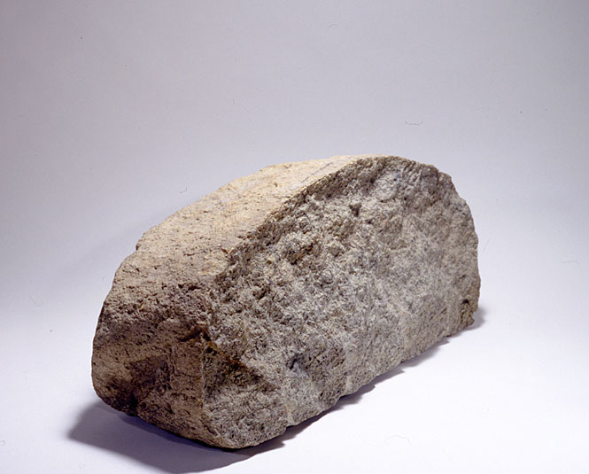

# LoRA Fine-Tuning
---
## 1. LoRA Overview

LoRA (Low-Rank Adaptation) is a technique for efficiently fine-tuning large language models. Instead of fine-tuning the entire weight matrix `W` to create an update `∆W`, LoRA only tunes two smaller low-rank matrices, `A` and `B`. These matrices are used to approximate `∆W` by composing `A @ B`, as shown below:

For a model dimension `dm` of 1k, the number of trainable parameters for full fine-tuning is `parameter count in ∆W = dm x dm`, which equals `1k x 1k = 1M`. In contrast, the number of trainable parameters for LoRA fine-tuning is the sum of the parameters in `A` and `B`. Assuming a rank of 8, this is calculated as `parameter count in A + parameter count in B = dm x 8 + 8 x dm`, which equals `16k` (as shown below). This significant reduction in trainable parameters decreases VRAM requirements and reduces training time.

## 2. LoRA Fine-Tuning Workflow

In this project, the basic workflow for LoRA fine-tuning is designed as follows:

`Before training`: Run inference with the base model and use the result as a baseline.  
`During training`: Train the model until it overfits.  
`After training`: Select a checkpoint with the minimum loss, run inference again, and compare the results with the baseline to assess improvement.

#### Step 1: Preparation
`1.1` Install Necessary Python Packages  
`1.2` Restart Kernel to Activate Installed Packages  

#### Step 2: Pre-Training
`2.1` Log in to Required Accounts (e.g., Hugging Face, Weights & Biases)  
`2.2` Load the Processor (Tokenizer) and the Base Model  
`2.3` Load the Dataset and (Optional) Perform Dry Runs for Tokenization  
`2.4` Perform Inference with the Base Model to Establish a Baseline  

#### Step 3: Training
`3.1` Add a Custom Padding Token  
`3.2` Create a LoRA Adapter  
`3.3` Set Up the Trainer and (Optional) Perform a Dry Run with a Custom DataCollator  
`3.4` Train the Model  
`3.5` (Optional) Examine the Training Results  

#### Step 4: Post-Training
`4.1` Restart Kernel for a Clean Environment  
`4.2` Load the Fine-Tuned Model from a Checkpoint  
`4.3` Perform Inference with the Fine-Tuned Model  
`4.4` Save the Fine-Tuned Model Locally  
`4.5` (Optional) Push the Fine-Tuned Model to the Hugging Face Hub  

## 3. Fine-Tuning Runs and GPU Selection 

`Run 1`: `run_1_a6000_48g_x1` (GPU: 1 x RTX A6000 48GB)  

## 4. File Structure in Run Folder 

`./lora_finetuning_complete.ipynb` [1] : A complete version notebook for LoRA fine-tuning. This notebook includes the definition of reusable functions, the LoRA fine-tuning workflow, and optional steps that readers can explore in the fine-tuning process.  
`./lora_finetuning.ipynb` [2] : A simplified version notebook for LoRA fine-tuning. This notebook includes only the essential steps of the LoRA fine-tuning workflow.  

The following two files are generated by the complete LoRA fine-tuning notebook. They have been reused in the simplified LoRA fine-tuning notebook and are also intended for reuse in other fine-tuning settings (such as Full Fine-Tuning, DDP, MP, and FSDP):  
`./my_login.py`: Contains reusable login functions (e.g., for Hugging Face and Weights & Biases).  
`./my_utils.py`: Contains general-purpose utility functions for fine-tuning (e.g., loading the processor, model, and dataset; performing batch inference; calculating semantic similarity scores; setting up the trainer; and running training).  

`./results`: Root directory for all training and inference outputs.  
`./results/model_info`: Stores printed information about the model's configuration and parameters.  
`./results/inference_results`: Stores outputs generated from inference runs.  
`./results/training_checkpoints`: Stores checkpoints saved during training for potential recovery.  
`./results/finetuned_model`: Stores the final fine-tuned model, ready for deployment.  
`./results/tensorboard_logs`: Contains log files generated for TensorBoard  

`./wandb`: Stores metrics, logs, and other artifacts generated by Weights & Biases  
`./models--HuggingFaceM4--idefics2-8b`: Contains the idefics2 base model downloaded from Hugging Face  

[1] [2]: Please note that in these notebooks, progress bars may display 0% for various HuggingFace operations (e.g., loading processors, models, datasets, or pushing models) when viewing saved Jupyter notebooks. This is a known behavior: progress bars show 100% during execution but revert to 0% upon saving, due to how Jupyter handles dynamic progress tracking.  

## 5. Settings and Hyperparameters in LoRA Fine-Tuning

#### Dataset

The dataset was generated in the previous step (`1_synthetic_data_creation`) and is split into three parts: `training`, `validation`, and `test`. The `training` and `validation` splits are used during training to compute the training and validation losses, respectively. The `test` split is reserved for evaluating model performance on unseen data during inference.

#### Padding Token

To maintain consistency across training, we use `<pad>` as the padding token. This ensures that all sequences in each batch are padded to the same length.

#### Tunable Layers

The base model is structured into three main modules: `vision_model`, `text_model`, and `connector`. For this project, the focus is on enhancing the model's ability to interpret and respond to exhibition images with historical and contextual insights, rather than capturing fine-grained image details (as would be required in applications like medical image diagnosis). Therefore, we will freeze the `vision_model` module and only fine-tune the `text_model` and `connector` modules.  

When fine-tuning, it's common practice to freeze the `embedding`, `normalization`, and `lm_head` layers. This approach helps maintain the model's foundational language capabilities, enhances stability, and reduces overfitting. Here, we will apply LoRA adapters specifically to the `linear` layers within the `text_model` and `connector` modules to refine the model's task-specific understanding.

#### LoRA Rank (r)

In our experiments, values of `r = 8`, `16`, `32`, and `64` yielded comparable results. We choose `r = 8` as our LoRA rank because a smaller rank reduces the number of trainable parameters, leading to lower VRAM consumption while achieving similar performance.

#### Trainable Parameters

By selecting specific tunable layers and an optimal LoRA rank as shown above, the number of trainable parameters for our LoRA fine-tuning is only `0.28%` of the total model parameters.

#### LoRA Alpha

When using Rank-Stabilized LoRA (RS-LoRA), the rule of thumb for setting lora_alpha is to scale it based on the square root of the model dimension (dm). Specifically, lora_alpha is often set as: `lora_alpha = sqrt(dm)`, where `dm` is the module dimension.  

Since our model's text module dimension (dm) is `4096` (retrieved from `base_model.config.text_config.hidden_size`), we calculate: `lora_alpha = sqrt(dm) = sqrt(4096) = 64`. This setup helps achieve a balanced scaling for stable and effective fine-tuning.  

#### Learning Rate

Generally, a small learning rate is chosen at the beginning of experiments. If convergence is slow, the rate can be gradually increased. Conversely, if the loss curve is unstable, the rate may be reduced. In our experiments, we use `1e-5`, which has proven effective for achieving stable convergence.

For stable training, we slowly ramp up the learning rate at the beginning of training by setting `warmup_ratio=0.03`, and gradually reduce the learning rate toward the end of training by setting `lr_scheduler_type="cosine"`.

#### Batch Size

Both training and evaluation batch sizes are constrained by VRAM limitations, with the training batch size typically hitting the VRAM bottleneck first. While training and evaluation batch sizes can differ, for simplicity, we use `the same batch size for both`. To determine the maximum workable training batch size, we start with a small batch size (e.g., 1) and gradually increase it until the GPU's VRAM limit is reached (resulting in an Out of Memory error). Once the maximum stable training batch size is identified, it is used for both training and evaluation to ensure consistency.

#### Gradient Accumulation Steps

Gradient accumulation effectively simulates a larger batch size on GPUs with limited VRAM by accumulating gradients over multiple forward passes before performing a backward update. Large batch sizes generally yield more stable training by averaging gradients over more samples, often resulting in better generalization. However, for this project, with a relatively small dataset, we aim to maximize the model's ability to capture dataset-specific details. Thus, we use a small batch size and set the gradient accumulation step to `1` to allow more updates on limited data during training so the model can memorize specific details. Experiments show that values of `1` or `2` yield the best results, while higher values (e.g., `>=3`) degrade performance.

#### Data Type

By default, models are trained in `fp32` (32-bit, range: ±1.18e-38 ~ ±3.39e38). In our experiments, we use `bf16` (16-bit, range: ±1.18e-38 ~ ±3.39e38), supported by Nvidia Ampere architecture GPUs, which uses half the memory of fp32 while maintaining training stability due to its range. Note that `fp16` (16-bit, range: ±6.55e-5 to ±6.55e4) also halves memory usage but can cause training instability due to its limited range.

#### Gradient Checkpointing

We enable `gradient_checkpointing` during training. This reduces VRAM usage by storing only select gradients but requires additional computation time, as activation values are recalculated during the backward pass. This approach allows training on GPUs with limited VRAM and enables larger batch sizes, accelerating the overall training process.

Please note that gradient checkpointing is enabled only for non-FSDP training. For FSDP training, activation checkpointing is enabled through the `FSDP config`.

#### Used and Unused Columns

`"Used"` columns are the dataset columns that are directly consumed by the model's forward method, such as `input_ids` and `attention_mask`. Other columns (`"Unused"`) are not directly related to the model's forward method but may still be required for data processing in a custom collate_fn, such as `image` and `dialog` columns.

To ensure all necessary columns are available, we retain all columns in the dataset by setting `remove_unused_columns=False` in the trainer setup.

#### Step-Based Triggers

`train_steps = (epoch_num * total_samples_in_dataset) / (batch_size * gradient_accumulation_steps)`

We use training steps to trigger evaluation, log metrics, and save model checkpoints. For simplicity, we set 5% of total training steps as an interval to trigger these three activities: `eval_steps=0.05`, `logging_steps=0.05`, and `save_steps=0.05`.

## 6. LoRA Fine-Tuning Results

#### Ground Truth

After retrieving raw exhibition information—official descriptions of the exhibitions—from the Smithsonian Institution ([si.edu](https://www.si.edu)), we used the OpenAI API ([openai.com](https://www.openai.com)) to generate a synthetic dataset based on this information. Using three different temperature settings, `GPT-4o mini` was used to generate a total of 15 question-answer pairs for each exhibition. We then selected the pairs generated at the low-temperature setting as the `Ground Truth`, as these responses are stable, deterministic, and accurately reflect the exhibition details. These selected pairs, along with the true exhibition images, form the `test` split of the synthetic dataset.

#### Similarity Score

To evaluate the quality of the model-generated answers, we compare the embeddings of the generated answers with those of the ground truth answers to assess their semantic proximity in an embedding vector space. There are two types of embeddings: `static embeddings` (from the model's embedding layer) and `contextual embeddings` (from the model's last hidden layer). In this experiment, we use contextual embeddings for evaluation, as they better represent semantic meanings.

To obtain these embeddings, we input both the generated answers and the ground truth answers into a model (the base model before fine-tuning or the fine-tuned model after fine-tuning) to extract contextual embeddings. We then calculate the distance between these two embeddings to derive a similarity score. For the entire dataset, we compute the average similarity score across all exhibitions to measure overall performance. For simplicity, we refer to this average similarity score as the `Similarity Score` throughout this article.

#### Overall Model Quality Improvement Brought by LoRA Fine-Tuning

The best possible `Similarity Score` is `0`, which indicates a perfect match with the `Ground Truth`. With LoRA fine-tuning, we improved the `Similarity Score` of model-generated answers from `0.596` to `0.037`, reflecting a significant enhancement in answer quality.

| **Approach**                    | **GPU Setup**      | **Training Epochs** | **Batch Size** | **Training Time** | **Similarity Score**  |
|---------------------------------|--------------------|---------------------|----------------|-------------------|-----------------------|
| No Tuning [3]        | -                  | -                   | -              | -                 | 0.596                 |
| LoRA Fine-Tuning [4] | RTX A6000 (48G) x1 | 3                   | 14             | 23:51             | 0.037                 |

[3]: Original model without any fine-tuning.  
[4]: LoRA Fine-Tuning with 1 RTX A6000 (48G) GPU. The experiment results are from the [Complete LoRA Fine-Tuning Notebook](./run_1_a6000_48g_x1/lora_finetuning_complete.ipynb).

#### Model Quality Improvement Demonstrated by Individual Test Results 

As shown in the table below, the generated answers from the fine-tuned model provide nuanced, informative responses that convey details about the exhibition's craftsmanship, history, and cultural significance, offering more depth and meaning than the base model.

| **User Query**  (with an exhibition image and a question) | **Generated Answer from Base Model** | **Generated Answer from LoRA Fine-Tuned Model** |
|--------------------------------------------------------------|--------------------------------------|-------------------------------------------------|
| Can you describe this exhibit?|This is a sculpture.|This exhibit features the innovative work of Peter Shire, an artist born in Los Angeles in 1947. One of the standout pieces is the Weathervane Teapot, created in 1981, which exemplifies Shire's unique approach to ceramic art. The teapot is characterized by its playful design, incorporating colorful shapes such as squares and spheres, along with whimsical rods and hollow tubes. Shire's intention was to challenge traditional, class-based perceptions of "tea-time," making it a practice that is accessible to everyone. The teapot's unconventional construction invites viewers to engage with it, raising questions about its functionality and how to handle it. After 1985, Shire shifted his focus to furniture design, marking a significant transition in his artistic journey. This piece is part of the Smithsonian American Art Museum's collection, generously donated by Donna and John Donaldson in honor of the anniversaries of the James Renwick Alliance and the Renwick Gallery.|
| Can you describe this exhibit?|This is a large rock that is textured and colored unevenly.|This exhibit features the Nakhla Meteorite Fragment at the Smithsonian's National Museum of Natural History, a significant specimen among the thirty-four known meteorites that have originated from Mars. The Nakhla meteorite fell on June 28, 1911, in the Nakhla region of Alexandria, Egypt, where it was observed exploding in the atmosphere before breaking into approximately forty pieces, with a total weight of 22 pounds. Many of these fragments were found buried up to a meter deep. The Smithsonian acquired two samples shortly after the fall, and in 1962, it added a 480-gram fragment, bringing its total collection to 650 grams by the 1970s. The Nakhlites, a term referring to Martian meteorites named after Nakhla, are igneous rocks rich in augite formed from basaltic magma around 1.3 billion years ago. Research indicates that these meteorites were once hydrated and were altered by liquid water around 620 million years ago. They were ejected from Mars due to an asteroid impact about 10.75 million years ago and landed on Earth within the last 10,000 years.|
| Can you describe this exhibit?|This is a rock.|This exhibit features the Plymouth Rock Piece from 1620, an iconic artifact at the National Museum of American History. Traditionally regarded as the landing site of the Mayflower Pilgrims, Plymouth Rock is steeped in history. The rock's origins are somewhat mysterious, but it is believed to have been moved from its original location in the 1700s to its current spot on the shore of Plymouth Harbor. In 1880, a significant piece was discovered being used as a doorstep by the Plymouth Antiquarian Society, which was later broken into three parts. One of these pieces was donated to the Smithsonian in 1984, and museum officials accepted it in 1985. This rock fragment, measuring 22 inches by 11.5 inches, is composed of granite and has a fascinating history tied to the Pilgrims' arrival in Plymouth, Massachusetts.|
| What can you tell me about this exhibit?|A collection of old fashioned planes are on display in a museum.|The exhibit features the iconic 1903 Wright Flyer, a pioneering aircraft that marked the dawn of powered flight. Built by the Wright brothers, Wilbur and Orville, this biplane is powered by a 12-horsepower engine that operates two pusher propellers via a sprocket-and-chain system. Its unique landing gear consists of linear skids, and it is covered in natural fabric, without any paint or sealant. The Flyer made its historic first flight on December 17, 1903, in Kitty Hawk, North Carolina, with Orville at the controls for a brief 12-second journey. The Wrights' innovative methods, including wind tunnel testing, were instrumental in achieving this feat, establishing principles that would shape modern aeronautics. This exhibit not only highlights the Flyer as a mechanical marvel but also celebrates the Wright brothers' legacy in transforming the concept of human flight.|

## 7. References
`[HF: LoRA conceptual guide]`: https://huggingface.co/docs/peft/main/en/conceptual_guides/lora  
`[HF: LoRA developer guide]`: https://huggingface.co/docs/peft/main/en/developer_guides/lora  
`[HF: padding guide]`: https://huggingface.co/docs/transformers/en/pad_truncation  
`[Idefics2 fine-tuning tutorial]`: https://colab.research.google.com/drive/1rm3AGquGEYXfeeizE40bbDtcWh5S4Nlq  
