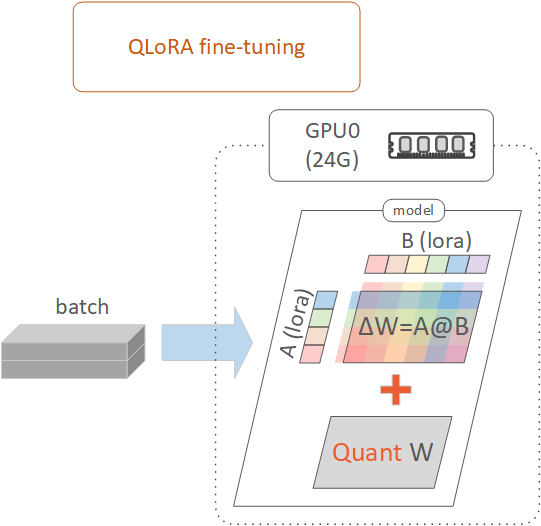

# QLoRA Fine-Tuning

---

## 1. QLoRA Fine-Tuning Overview

QLoRA (Quantized LoRA) is a technique similar to standard LoRA (Low-Rank Adaptation) fine-tuning, with the key difference being that the base model is loaded into VRAM in a 4-bit quantized form, as shown below. This approach dramatically reduces memory usage for fine-tuning large language models, enabling the process to be performed on GPUs with smaller VRAM.

For example, when fine-tuning a model with 7 billion parameters in bf16 resolution, the VRAM overhead of the LoRA adapter remains the same for both LoRA and QLoRA. However, standard LoRA fine-tuning requires `7G parameters * 2 bytes = 14GB` of VRAM to store the base model (bf16 resolution uses 2 bytes per parameter). In contrast, QLoRA fine-tuning requires `7G parameters * 0.5 bytes = 3.5GB` of VRAM to store the base model (4-bit quantization uses 0.5 bytes per parameter). This significant reduction in total GPU VRAM usage makes it possible to fine-tune on GPUs with smaller VRAM capacities, such as the RTX A5000 or A4000.

## 2. QLoRA Fine-Tuning Workflow

In this project, the workflow for QLoRA fine-tuning follows the same steps as those used in LoRA fine-tuning. For more details, refer to the 'Fine-Tuning Workflow' section in the [LoRA Fine-Tuning Readme](../2.1_lora_finetuning/lora_finetuning_readme.md#2-lora-fine-tuning-workflow).

## 3. Fine-Tuning Runs and GPU Selection 

`Run 1`: `run_1_a5000_24g_x1` (GPU: 1 x RTX A5000 24GB)  
`Run 2`: `run_2_a4000_16g_x1` (GPU: 1 x RTX A4000 16GB)  

## 4. File Structure in Run Folder 

`./qlora_finetuning.ipynb`: A notebook for QLoRA fine-tuning.  

`./my_utils_qlora.py`: Contains utility functions specific to QLoRA fine-tuning, such as a function to create a quantization configuration for QLoRA fine-tuning.  

The remaining files in the run folder are similar to those used in LoRA fine-tuning. For more details, refer to the 'File Structure' section in the [LoRA Fine-Tuning Readme](../2.1_lora_finetuning/lora_finetuning_readme.md#4-file-structure-in-run-folder).  

## 5. Settings and Hyperparameters in QLoRA Fine-Tuning

#### Quantization Configuration

Base model weights are loaded into VRAM with `4-bit quantization`. Specifically, the model is first quantized to 8-bit and then further quantized to 4-bit using NF4 (Normal Float 4-bit) quantization. During the computation phase, 4-bit quantized weights are upcast to bfloat16 for operations.

#### Attention Implementation

In LoRA fine-tuning, `flash_attention_2` is used, which significantly reduces VRAM usage and improves efficiency for LLaMA architecture models. However, in QLoRA fine-tuning, mixed-precision issues were encountered when using `flash_attention_2`. As a result, the `eager` attention implementation has been adopted instead, offering moderate VRAM savings.

Other settings and hyperparameters are similar to those described in LoRA fine-tuning. For more details, refer to the 'Settings and Hyperparameters' section in the [LoRA Fine-Tuning Readme](../2.1_lora_finetuning/lora_finetuning_readme.md#5-settings-and-hyperparameters-in-lora-fine-tuning).

## 6. QLoRA Fine-Tuning Results

#### Overall Fine-Tuned Model Quality and Total GPU VRAM Requirement (QLoRA Fine-Tuning vs LoRA Fine-Tuning) 

As shown, the similarity scores for both QLoRA and LoRA are around 0.04, demonstrating that QLoRA retains similar model quality to LoRA while requiring far less GPU VRAM, which enables users to fine-tune large language models using more affordable GPUs like the RTX A5000 and A4000.

| **Approach**                      | **GPU Setup**      | **Training Epochs** | **Batch Size** | **Training Time** | **Similarity Score** | **Total GPU VRAM Requirement** |
|-----------------------------------|--------------------|---------------------|----------------|-------------------|----------------------|--------------------------------|
| LoRA Fine-Tuning [1]   | RTX A6000 (48G) x1 | 3                   | 14             | 23:51             | 0.037                | 1x (100% VRAM)                 |
| QLoRA Fine-Tuning [2]  | RTX A5000 (24G) x1 | 3                   | 3              | 55:32             | 0.042                | 0.5x (50% of LoRA VRAM)        |
| QLoRA Fine-Tuning [3]  | RTX A4000 (16G) x1 | 3                   | 2              | 1:15:53           | 0.036                | 0.33x (33% of LoRA VRAM)       |

[1]: LoRA Fine-Tuning with 1 RTX A6000 (48G) GPU. The experiment results are from the [Complete LoRA Fine-Tuning Notebook](../2.1_lora_finetuning/run_1_a6000_48g_x1/lora_finetuning_complete.ipynb).
[2]: QLoRA Fine-Tuning with 1 RTX A5000 (24G) GPU. The experiment results are from the [QLoRA Fine-Tuning Notebook (A5000)](./run_1_a5000_24g_x1/qlora_finetuning.ipynb).
[3]: QLoRA Fine-Tuning with 1 RTX A4000 (16G) GPU. The experiment results are from the [QLoRA Fine-Tuning Notebook (A4000)](./run_2_a4000_16g_x1/qlora_finetuning.ipynb).

## 7. References
`[HF: quantization]`: https://huggingface.co/docs/peft/main/en/developer_guides/quantization  
