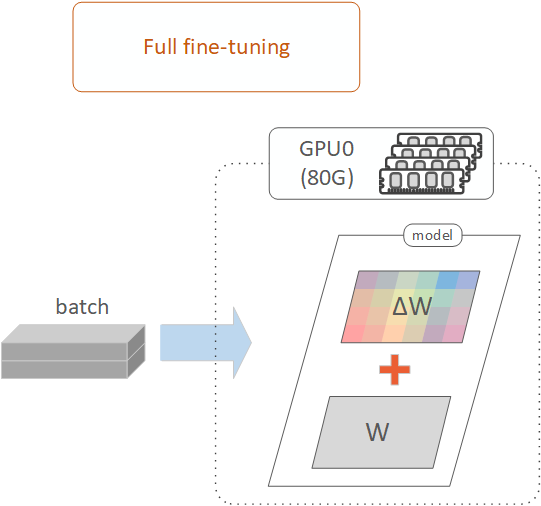

# Full Fine-Tuning

---

## 1. Full Fine-Tuning Overview

Full fine-tuning directly adjusts the model's weights, rather than approximating the weight updates through low-rank matrices (e.g., A and B matrices) as in LoRA fine-tuning. Since this method operates directly on the model weights, it offers finer granularity in tuning, which can lead to better model quality compared to LoRA fine-tuning.

In our experiments, full fine-tuning demonstrated slightly better model quality, achieving a similarity score of around 0.03 compared to 0.04 for LoRA fine-tuning. However, the drawback of full fine-tuning is its significantly higher memory consumption during training. This is because the weights of all tunable modules are loaded into VRAM, whereas LoRA only requires smaller low-rank matrices to be loaded into VRAM to approximate the weights of those tunable modules. 

For example, in our experiments, 48GB of VRAM was insufficient for full fine-tuning, necessitating the use of larger VRAM GPUs such as the NVIDIA A100.

## 2. Full Fine-Tuning Workflow

In this project, the workflow for full fine-tuning follows the same steps as those used in LoRA fine-tuning. For more details, refer to the 'Fine-Tuning Workflow' section in the [LoRA Fine-Tuning Readme](../2.1_lora_finetuning/lora_finetuning_readme.md#2-lora-fine-tuning-workflow).

The key difference in the full fine-tuning notebook is that, before training, the parameters of the base model are directly set as trainable, instead of creating a LoRA adapter. The trainable parameters include the linear (`'proj'`) layers in the `text_model` and `connector` modules. After training, the fine-tuned model can be directly loaded from a checkpoint and saved locally, eliminating the need to merge LoRA weights with the base model weights.

## 3. Fine-Tuning Runs and GPU Selection 

`Run 1`: `run_1_a100_80g_x1` (GPU: 1 x A100 80GB)  

## 4. File Structure in Run Folder 

`./full_finetuning.ipynb`: A notebook for full fine-tuning.  

`./my_utils_full_finetuning.py`: Contains utility functions specific to full fine-tuning, including a function to set model parameters as trainable in selected layers of the base model for full fine-tuning.  

The remaining files in the run folder are similar to those used in LoRA fine-tuning. For more details, refer to the 'File Structure' section in the [LoRA Fine-Tuning Readme](../2.1_lora_finetuning/lora_finetuning_readme.md#4-file-structure-in-run-folder).  

## 5. Settings and Hyperparameters in Full Fine-Tuning

The settings and hyperparameters used in full fine-tuning are similar to those described in LoRA fine-tuning, except that LoRA-specific settings and hyperparameters are not required for full fine-tuning. For more details, refer to the 'Settings and Hyperparameters' section in the [LoRA Fine-Tuning Readme](../2.1_lora_finetuning/lora_finetuning_readme.md#5-settings-and-hyperparameters-in-lora-fine-tuning).

## 6. Full Fine-Tuning Results

#### Overall Fine-Tuned Model Quality (Full Fine-Tuning vs LoRA Fine-Tuning) 

As shown below, the similarity scores for full fine-tuning (around 0.03) are slightly better than those for LoRA fine-tuning (around 0.04). This demonstrates that full fine-tuning offers improved model quality but comes with higher VRAM requirements and longer training times for the same number of training epochs.

| **Approach**                    | **GPU Setup**      | **Training Epochs** | **Batch Size** | **Training Time** | **Similarity Score** |
|---------------------------------|--------------------|---------------------|----------------|-------------------|----------------------|
| LoRA Fine-Tuning [1] | RTX A6000 (48G) x1 | 3                   | 14             | 23:51             | 0.037                |
| Full Fine-Tuning [2] | A100 (80G) x1      | 3                   | 10             | 53:20             | 0.031                |

[1]: LoRA Fine-Tuning with 1 RTX A6000 (48G) GPU. The experiment results are from the [Complete LoRA Fine-Tuning Notebook](../2.1_lora_finetuning/run_1_a6000_48g_x1/lora_finetuning_complete.ipynb).  
[2]: Full Fine-Tuning with 1 A100 SXM (80G) GPU. The experiment results are from the [Full Fine-Tuning Notebook](./run_1_a100_80g_x1/full_finetuning.ipynb).

## 7. References
