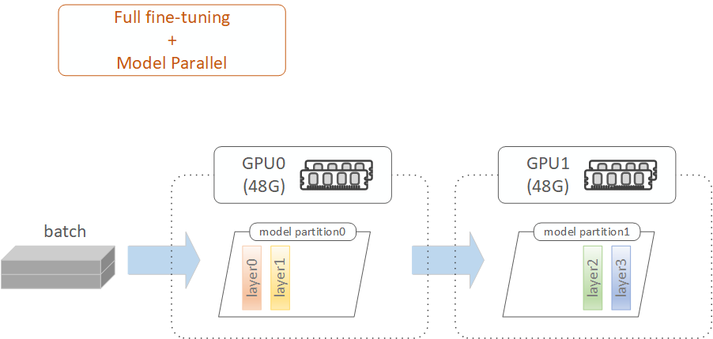

# Full Fine-Tuning with Model Parallel (MP)

---

## 1. Full Fine-Tuning with MP Overview

Full fine-tuning with Model Parallel (MP) combines the benefits of full fine-tuning with the scalability of distributed training. MP enables full fine-tuning across multiple GPUs, making it feasible to train large language models that would otherwise exceed the VRAM capacity of a single GPU. By distributing model layers across GPUs, MP reduces the memory burden on a single GPU, enabling efficient training of high-memory models.

In our experiments, model layers were evenly split across all GPUs, with forward and backward passes sequentially traversing the GPUs layer by layer. Layer balancing (i.e., VRAM load balancing) is critical. If unbalanced, the most heavily loaded GPU becomes a bottleneck due to memory shortages, limiting the training batch size. Smaller batch sizes require more training iterations to process the same amount of data, which increases overall training time.

In the example above, for full fine-tuning with MP using 2 GPUs, the model layers are evenly divided across the GPUs, with each GPU handling computations for its assigned layers. This approach enables full fine-tuning, which normally requires high VRAM, to be conducted on multiple smaller VRAM GPUs, such as 2 RTX A6000 GPUs or 4 RTX A5000 GPUs.

## 2. Full Fine-Tuning with MP Workflow

In this project, the workflow for full fine-tuning with Model Parallel (MP) follows the same steps as those used in standard full fine-tuning. For more details, refer to the 'Fine-Tuning Workflow' section in the [Full Fine-Tuning Readme](../2.4_full_finetuning/full_finetuning_readme.md#2-full-fine-tuning-workflow).

The key difference in the full fine-tuning with MP notebook is the creation of custom device maps to balance VRAM usage across 2 GPUs or 4 GPUs during MP training. These device maps ensure that model layers are evenly distributed across GPUs, optimizing memory allocation and preventing bottlenecks.

## 3. Fine-Tuning Runs and GPU Selection 

`Run 1`: `run_1_a6000_48g_x2` (GPUs: 2 x RTX A6000 48GB)  
`Run 2`: `run_2_a5000_24g_x4` (GPUs: 4 x RTX A5000 24GB)  

## 4. File Structure in Run Folder 

`./full_finetuning_with_mp.ipynb`: A notebook for full fine-tuning with Model Parallel (MP).  

`./my_utils_full_finetuning_with_mp.py`: Contains utility functions specific to full fine-tuning with MP. For example, it includes a function to set model parameters as trainable in selected layers of the base model for full fine-tuning, and functions to create custom device maps for 2-GPU and 4-GPU MP training.  

The remaining files in the run folder are similar to those used in standard full fine-tuning. For more details, refer to the 'File Structure' section in the [Full Fine-Tuning Readme](../2.4_full_finetuning/full_finetuning_readme.md#4-file-structure-in-run-folder).

## 5. Settings and Hyperparameters in Full Fine-Tuning with MP

#### Device Map

To optimize workload distribution, we initially used `device_map='auto'` for Model Parallel training and monitored VRAM usage across GPUs. Imbalances in memory usage were identified and addressed by tweaking the layer distribution, creating custom device maps for multi-GPU training to ensure evenly balanced VRAM loads.

Other settings and hyperparameters are similar to those described in standard full fine-tuning. For more details, refer to the 'Settings and Hyperparameters' section in the [Full Fine-Tuning Readme](../2.4_full_finetuning/full_finetuning_readme.md#5-settings-and-hyperparameters-in-full-fine-tuning).

## 6. Full Fine-Tuning with MP Results

#### Overall Fine-Tuned Model Quality and VRAM Requirement per GPU (Full Fine-Tuning with MP vs Full Fine-Tuning)

As shown below, `Full Fine-Tuning with MP` retains similar model quality (Similarity Score around 0.03) to `Standard Full Fine-Tuning`. However, it significantly reduces VRAM requirement per GPU, making it feasible to perform full fine-tuning using a group of lower VRAM GPUs, compared to requiring a single high-end GPU.

| **Approach**                            | **Training Epochs** | **Batch Size** | **Similarity Score** |
|-----------------------------------------|---------------------|----------------|----------------------|
| Full Fine-Tuning [1]         | 3                   | 10             | 0.031                |
| Full Fine-Tuning with MP [2] | 3                   | 8              | 0.029                |
| Full Fine-Tuning with MP [3] | 3                   | 5              | 0.028                |

| **Approach**                            | **GPU Setup**      | **CUDA Scaling Factor** | **VRAM Scaling Factor** | **Training Time** | **VRAM Requirement per GPU**                                                   |
|-----------------------------------------|--------------------|-------------------------|-------------------------|-------------------|--------------------------------------------------------------------------------|
| Full Fine-Tuning [1]         | A100 (80G) x1      | 1x (6,912 x1)           | 1x (80G x1)             | 53:20             | 1x (requires high-end 80G GPU, baseline)                                       |
| Full Fine-Tuning with MP [2] | RTX A6000 (48G) x2 | 3.11x (10,752 x2)       | 1.2x (48G x2)           | 40:41             | 0.6x (works with mid-range 48G GPUs, reducing VRAM requirement per GPU by 40%) |
| Full Fine-Tuning with MP [3] | RTX A5000 (24G) x4 | 4.74x (8,192 x4)        | 1.2x (24G x4)           | 1:15:55           | 0.3x (works with mid-range 24G GPUs, reducing VRAM requirement per GPU by 70%) |

[1]: Full Fine-Tuning with 1 A100 SXM (80G) GPU. The experiment results are from the [Full Fine-Tuning Notebook](../2.4_full_finetuning/run_1_a100_80g_x1/full_finetuning.ipynb).  
[2]: Full Fine-Tuning with 2 RTX A6000 (48G) GPUs. The experiment results are from the [Full Fine-Tuning with MP Notebook (2 x A6000)](./run_1_a6000_48g_x2/full_finetuning_with_mp.ipynb).  
[3]: Full Fine-Tuning with 4 RTX A5000 (24G) GPUs. The experiment results are from the [Full Fine-Tuning with MP Notebook (4 x A5000)](./run_2_a5000_24g_x4/full_finetuning_with_mp.ipynb).

## 7. References

`[HF: Designing a device map]`: (https://huggingface.co/docs/accelerate/main/en/concept_guides/big_model_inference#designing-a-device-map)  
`[HF: Naive Model Parallelism]`: (https://huggingface.co/docs/transformers/en/perf_train_gpu_many#from-naive-model-parallelism-to-pipeline-parallelism)  
