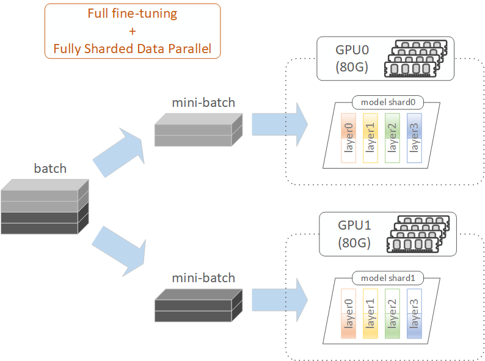

# Full Fine-Tuning with Fully Sharded Data Parallel (FSDP)

---

## 1. Full Fine-Tuning with FSDP Overview

`Full fine-tuning with Fully Sharded Data Parallel (FSDP)` combines the benefits of full fine-tuning with the scalability of distributed training. It enables full fine-tuning across multiple GPUs, facilitating faster training of large language models and the ability to handle larger batch sizes.

Compared with `full fine-tuning with Model Parallel (MP)`, both approaches partition the model, but in different ways. MP divides the model vertically, splitting layers across GPUs, while FSDP divides the model horizontally, partitioning within layers. In FSDP, users do not need to manually specify how the model is sharded across GPUs. Instead, they only need to list the layer classes to be sharded, and the Hugging Face library (leveraging PyTorch's Fully Sharded Data Parallel) handles model sharding automatically. In our experiments, attention (Attn) and feedforward (MLP) layers were sharded. Norm layers were excluded from sharding due to their small size, and embedding layers remained fully replicated on each GPU to minimize cross-GPU communication costs during training.

Compared with `LoRA fine-tuning with Distributed Data Parallel (DDP)`, both approaches distribute training data (mini-batches) across GPUs for parallel processing. The key difference is that DDP maintains a complete copy of the model on each GPU, while FSDP shards the model across GPUs. In FSDP, GPUs fetch missing weights on the fly from other GPUs during layer computation and release them after computation. Gradients are computed locally for each shard and synchronized across GPUs after the backward pass, while optimizer states are maintained locally for the respective shards.

In the example above, for full fine-tuning with FSDP using 2 GPUs, the training data batch is split into 2 mini-batches. Each GPU hosts half of the model, fetches missing weights on the fly from the other GPU, and processes its assigned mini-batch independently. This approach not only enables training models that exceed the VRAM capacity of a single GPU by distributing the load across multiple GPUs, but also accelerates training, achieving a 1.43x speedup as shown in the 'Results' section below.

## 2. Full Fine-Tuning with FSDP Workflow

In this project, the workflow for full fine-tuning with FSDP follows the same steps as those used in standard full fine-tuning. For more details, refer to the 'Fine-Tuning Workflow' section in the [Full Fine-Tuning Readme](../2.4_full_finetuning/full_finetuning_readme.md#2-full-fine-tuning-workflow).

The key difference in the full fine-tuning with FSDP notebook is that the `pre-training` and `training` steps are encapsulated within a workflow function. This workflow function is then executed using either `notebook_launcher` or `accelerate launch`.

## 3. Fine-Tuning Runs and GPU Selection  

`Run 1`: `run_1_a100_80g_x2` (GPUs: 2 x A100 80GB [1])  
`Run 2`: `run_2_a6000_48g_x4` (GPUs: 4 x RTX A6000 48GB)  

[1]: [RunPod](https://runpod.io) offers two types of A100 GPUs: `A100 SXM` and `A100 PCIE`. Multi-GPU configurations with `A100 SXM` include SSD volume disks and NVLink GPU connections, which are faster than `A100 PCIE` configurations that use HDD volume disks and `PCIe + SMP Interconnect` for GPU connections. Additionally, we observed that `A100 SXM` GPUs are available in two variants: one with `32 vCPUs` and another with `16 vCPUs + Global Networking`. During our experiments, the `32 vCPUs` variant performed slower during FSDP training and frequently triggered `NCCL errors`. Therefore, we selected the `16 vCPUs + Global Networking` variant for our experiments. This configuration can be specifically chosen by filtering for the "Global Networking" feature during GPU selection.

## 4. File Structure in Run Folder

`./full_finetuning_with_fsdp_nblaunch.ipynb`: A notebook for full fine-tuning with FSDP. In this notebook, the workflow function is executed using `notebook_launcher`.  
`./full_finetuning_with_fsdp_acclaunch.ipynb`: A notebook for full fine-tuning with FSDP. In this notebook, the workflow function is executed using `accelerate launch`.  

`./my_utils_full_finetuning_with_fsdp.py`: Contains utility functions specific to full fine-tuning with Fully Sharded Data Parallel. For example, it includes a function to override the built-in print() function to prepend a prefix string to all printed messages; functions to print accelerator information, trainer details, and wrapping status; a function to set model parameters as trainable in selected layers of the base model for full fine-tuning; and a custom callback function to report VRAM usage, print mini-batch details, and display the parameter sharding percentage on the current device.  
`./my_workflow_full_finetuning_with_fsdp.py`: Contains a workflow function that encapsulates the pre-training and training steps for full fine-tuning, along with the modifications required for FSDP.  

`./my_accelerate_config.yaml`: Contains accelerate configuration for FSDP.  

The remaining files in the run folder are similar to those used in standard full fine-tuning. For more details, refer to the 'File Structure' section in the [Full Fine-Tuning Readme](../2.4_full_finetuning/full_finetuning_readme.md#4-file-structure-in-run-folder).  

## 5. Settings and Hyperparameters in Full Fine-Tuning with FSDP

#### Device Map

The `device_map` is set to `None` (i.e., no need to set `device_map`). Instead, the Hugging Face library leverages PyTorch's Fully Sharded Data Parallel to automatically shard model parameters across GPUs based on the accelerate configuration (`my_accelerate_config.yaml`). This eliminates the need for an explicitly defined `device_map` during multi-GPU training.

#### Accelerator

Each rank (process) uses two accelerators. The first is the `utility accelerator`, initialized at the beginning of each rank and used for read-only operations, such as providing the current rank ID to bind the rank to its corresponding GPU. It also synchronizes ranks using the `wait_for_everyone()` function. The second is the `internal accelerator`, initialized by the trainer, which moves dataloaders, model (weights and gradients), and optimizer to the GPU for training. Both accelerators share the same `AcceleratorState`, inheriting the distributed setup (process group, device mapping, etc.) from the environment variables or initialization process specific to the launcher used (e.g., `notebook_launcher` or `accelerate launch`).

#### Gradient Checkpointing

Setting `use_fsdp=True` during trainer setup disables gradient checkpointing-related settings from `TrainingArguments` and uses `activation_checkpointing` from the accelerate configuration instead.

#### Learning Rate Scaling

In parallel training with multiple GPUs (such as in FSDP), the effective batch size increases linearly with the number of GPUs, necessitating a learning rate adjustment. Two common approaches for scaling the learning rate are:  
`Linear Scaling`: Scale the learning rate proportionally to the batch size increase.  
`Square Root Scaling`: Scale the learning rate by the square root of the batch size increase, offering greater stability.  
In our experiments, we chose square root scaling for better training stability.

#### Model Checkpoint

During training, the `save_state()` function is called to save the model checkpoint (weights) in a `sharded-state` format. After training, the fine-tuned model is reconstructed by merging the `sharded-state` checkpoint weights into the `full-state` base model weights, using the checkpoint with the minimum loss.

#### Mixed Precision

To stabilize training, configure `mixed_precision` to `fp16` in the accelerate configuration. As suggested in [Link1](https://huggingface.co/blog/deepspeed-to-fsdp-and-back) and [Link2](https://huggingface.co/docs/accelerate/concept_guides/fsdp_and_deepspeed), `fp16` precision is recommended for FSDP. This setting automatically upcasts precision to `fp32` during training, improving stability.

Other settings and hyperparameters are similar to those described in standard full fine-tuning. For more details, refer to the 'Settings and Hyperparameters' section in the [Full Fine-Tuning Readme](../2.4_full_finetuning/full_finetuning_readme.md#5-settings-and-hyperparameters-in-full-fine-tuning).

## 6. Full Fine-Tuning with FSDP Results

#### Overall Fine-Tuned Model Quality and Training Speed (Full Fine-Tuning with FSDP vs Full Fine-Tuning)

As shown below, the similarity scores for both `Full Fine-Tuning with FSDP` and `standard Full Fine-Tuning` are approximately 0.03. This demonstrates that full fine-tuning with FSDP retains model quality while significantly accelerating training, achieving a 1.43x speedup with 2 GPUs and a 2.15x speedup with 4 GPUs that have lower VRAM capacity.

| **Approach**                              | **Training Epochs** | **Batch Size** | **Effective Batch Size** | **Learning Rate Scaling [5]** | **Checkpoint Saving (% Steps) [6]** | **Similarity Score** |
|-------------------------------------------|---------------------|----------------|--------------------------|------------------------------------------|------------------------------------------------|----------------------|
| Full Fine-Tuning [2]           | 3                   | 10             | 10 x1                    | 1x (1e-5)                                | 5%                                             | 0.031                |
| Full Fine-Tuning with FSDP [3] | 3                   | 14             | 14 x2                    | 1.7x (1.7e-5)                            | 7%                                             | 0.025                |
| Full Fine-Tuning with FSDP [4] | 3                   | 10             | 10 x4                    | 2x (2e-5)                                | 5%                                             | 0.030                |

| **Approach**                              | **GPU Setup**      | **GPU Connection** | **CUDA Scaling Factor** | **VRAM Scaling Factor** | **Training Time** | **Training Speedup Factor** |
|-------------------------------------------|--------------------|--------------------|-------------------------|-------------------------|-------------------|-----------------------------|
| Full Fine-Tuning [2]           | A100 (80G) x1      | -                  | 1x (6,912 x1)           | 1x (80G x1)             | 53:20             | 1x (53:20)                  |
| Full Fine-Tuning with FSDP [3] | A100 (80G) x2      | NVLink             | 2x (6,912 x2)           | 2x (80G x2)             | 37:11             | 1.43x (37:11)               |
| Full Fine-Tuning with FSDP [4] | RTX A6000 (48G) x4 | PCIe + Host Bridge | 6.22x (10,752 x4)       | 2.4x (48G x4)           | 24:51             | 2.15x (24:51)               |

[2]: Full Fine-Tuning with 1 A100 SXM (80G) GPU. The experiment results are from the [Complete Full Fine-Tuning Notebook](../2.4_full_finetuning/run_1_a100_80g_x1/full_finetuning.ipynb).  
[3]: Full Fine-Tuning with 2 A100 SXM (80G) GPUs. The experiment results are from the [Full Fine-Tuning with FSDP Notebook (2 x A100)](./run_1_a100_80g_x2/full_finetuning_with_fsdp_nblaunch.ipynb).  
[4]: Full Fine-Tuning with 4 RTX A6000 (48G) GPUs. The experiment results are from the [Full Fine-Tuning with FSDP Notebook (4 x A6000)](./run_2_a6000_48g_x4/full_finetuning_with_fsdp_nblaunch.ipynb).

[5]: Scaled learning rate calculation:
For training with 1 A100 GPU, the batch size is `10`, and the learning rate is `1e-5`. 
For training with 2 A100 GPUs, the effective batch size becomes `14 * 2 = 28`. Therefore, the scaled learning rate is `1.7e-5` (calculated as `sqrt(28 / 10) * 1e-5`). 
For training with 4 RTX A6000 GPUs, the effective batch size becomes `10 * 4 = 40`. Consequently, the scaled learning rate is `2e-5` (calculated as `sqrt(40 / 10) * 1e-5`).

[6]: By default, we save a model checkpoint every 5% of training steps. However, this default setting introduces a disproportionate checkpoint saving overhead in [3] compared to [2] and [4]. To ensure consistency in `checkpoint saving overhead per step` across all experiments, we reduced the saving interval in [3] from 5% to 7%.  
After adjustment:
In [2], each GPU saves a checkpoint (100% model weight) every 12.3 steps (equivalent to 8% model weight saved per step).  
In [3], each GPU saves a checkpoint (50% model weight) every 6.9 steps (equivalent to 7% model weight saved per step).  
In [4], each GPU saves a checkpoint (25% model weight) every 3.15 steps (equivalent to 8% model weight saved per step).  
This adjustment ensures that the `checkpoint saving overhead per step` remains consistent across all experiments, enabling fair comparisons of training time.

## 7. References

`[HF: Fully Sharded Data Parallel]`: (https://huggingface.co/docs/transformers/en/fsdp)  
`[PyTorch: Fully Sharded Data Parallel]`: (https://pytorch.org/docs/stable/fsdp.html#torch.distributed.fsdp.FullyShardedDataParallel)  
`[HF: FSDP vs DeepSpeed]`: (https://huggingface.co/docs/accelerate/concept_guides/fsdp_and_deepspeed)  
`[HF: AcceleratorState]`: (https://huggingface.co/docs/accelerate/en/package_reference/state#accelerate.state.AcceleratorState)  
`[HF: accelerate launch and notebook_launcher]`: https://huggingface.co/docs/transformers/en/accelerate  
