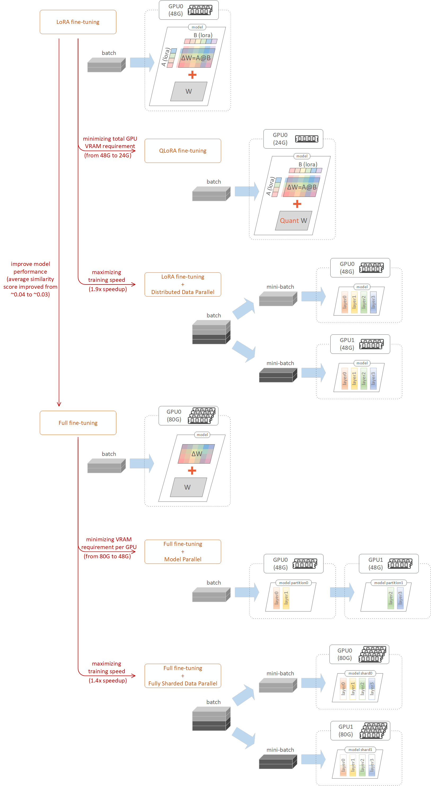

# Model Fine-Tuning
---
## Introduction

A model can gather and learn new knowledge through fine-tuning. In our experiments, we explored different approaches to fine-tune a vision model. The fine-tuned model gains the capability to interpret exhibition images by describing them in great detail while also highlighting their historical significance and social impact.

As illustrated in the image below, six different fine-tuning approaches were explored. `LoRA Fine-Tuning` is a popular technique that achieves impressive results with relatively low hardware requirements, making it our baseline approach. On top of `LoRA Fine-Tuning`, we further explored:
- `QLoRA Fine-Tuning`, which incorporates quantization to further reduce VRAM requirements for training.
- `LoRA Fine-Tuning with Distributed Data Parallel (DDP)`, which utilizes parallel training across multiple GPUs to speed up the training process.

For users seeking higher model quality, `Full Fine-Tuning` is recommended. This approach tunes the model with finer granularity, yielding better model quality compared to `LoRA Fine-Tuning`, though at the cost of increased computational resources. Similarly, on top of `Full Fine-Tuning`, we further explored:
- `Full Fine-Tuning with Model Parallel (MP)`, which splits the model by layers and distributes the split layers across multiple GPUs to reduce the VRAM requirements for training.
- `Full Fine-Tuning with Fully Shared Data Parallel (FSDP)`, which shards the model within layers and performs parallel training on multiple GPUs to accelerate the training process.

  

Please note that our experiments highlight only a few of the many possible approaches to fine-tuning. Additionally, the methods we covered are not mutually exclusive and can often be combined to achieve optimal results.

For example:
- Combining `LoRA Fine-Tuning` with `Fully Shared Data Parallel (FSDP)` is a hybrid approach that accelerates training while significantly reducing VRAM requirements.
- Integrating `Model Parallel (MP)` with `Fully Shared Data Parallel (FSDP)` in `Full Fine-Tuning` is an effective strategy for managing extremely large-scale models. This approach not only splits the model across layers but also shards within layers.

We encourage readers to explore and experiment with other fine-tuning techniques and combinations to further optimize model performance for their specific applications.

## Base Model

In our experiments, we selected Hugging Face's [Idefics2](https://huggingface.co/blog/idefics2) as the base model. Idefics2 is an 8-billion-parameter multimodal model that integrates Google's SigLIP (Significant Image Language Image Processing) vision model with Mistral AI's Mistral 7B language model.

At the time of writing, an upgraded version, [Idefics3](https://huggingface.co/HuggingFaceM4/Idefics3-8B-Llama3), has also been released. Idefics3 is another 8-billion-parameter multimodal model from Hugging Face, combining Google's SigLIP vision model with Meta's Llama3 8B instruct model. All the fine-tuning techniques discussed here are fully applicable to Idefics3 as well.

## Dataset

The dataset used in our experiments was created in a previous step (`1_synthetic_data_creation`) and has been uploaded to Hugging Face. It consists of 819 rows of training data, 82 rows of validation data for the training stage, and 74 rows of test data for post-training evaluation, as shown in the table below:

| **Dataset Split** | **Data Count** |
|-------------------|----------------|
| Train             | 819            |
| Validation        | 82             |
| Test              | 74             |

## Hardware

[RunPod](https://www.runpod.io) and [VastAI](https://www.vast.ai) are two popular GPU rental platforms. In our experiments, we used GPUs for both training and evaluation, renting GPUs from RunPod to execute our Jupyter notebooks.

#### RunPod Template

We conducted our experiments using RunPod's pods. A pod is a container environment with allocated GPUs designed to execute Jupyter notebooks. To initiate a pod, we first select the desired GPUs and then choose a `Pod Template`. During pod initialization, all software and configurations defined in the template are automatically installed and configured.

In our experiments, we selected the pod template `runpod/pytorch:2.4.0-py3.11-cuda12.4.1-devel-ubuntu22.04`. This template installs Ubuntu 22.04 as the operating system, along with PyTorch 2.4.0, Python 3.11, and CUDA 12.4.1. Users can easily find this template by searching for `pytorch 2.4.0` in the template search box. Once selected, users can further override configurations to suit their specific use cases.

For our experiments, we applied the following `Pod Template Overrides`:

| **Pod Template Overrides** | **Value**                                                                                                        |
|----------------------------|------------------------------------------------------------------------------------------------------------------|
| Container Disk             | 150GB (stores the operating system, software, and libraries)                                                     |
| Volume Disk                | Varies (stores notebook execution outputs and model checkpoints; see `Volume Disk` discussion below for details) |
| Volume Mount Path          | /workspace                                                                                                       |
| Expose HTTP Ports          | 8888, 6006 (8888 for Jupyter Notebook, 6006 for TensorBoard)                                                     |
| Expose TCP Ports           | 22 (for SSH access to the web terminal)                                                                          |

#### RunPod GPU

We used the following GPU types in our experiments. The rental costs reflect rates as of January 2025. Users may also choose the `A40` as a lower-cost alternative to the `RTX A6000` if available.

| **GPU Model** | **VRAM (Memory)** | **CUDA Cores** | **Rental Cost** |
|---------------|-------------------|----------------|-----------------|
| A100 PCIE     | 80G               | 6,912          | $1.64/hour      |
| RTX A6000     | 48G               | 10,752         | $0.76/hour      |
| RTX A5000     | 24G               | 8,192          | $0.36/hour      |
| RTX A4000     | 16G               | 6,144          | $0.32/hour      |

#### Volume Disk

In our experiments, model checkpoints (saved at every 5% of total training steps) were stored on the pod's volume disk. For LoRA and QLoRA experiments, a 150GB volume disk was more than sufficient. However, for full fine-tuning experiments, a significantly larger volume disk was required to store all model checkpoints, as shown in the table below.

| **Fine-Tuning Approach**               | **Volume Disk Size (Peak Usage)**        |
|----------------------------------------|------------------------------------------|
| LoRA Fine-Tuning                       | 150G                                     |
| QLoRA Fine-Tuning                      | 150G                                     |
| LoRA Fine-Tuning with DDP              | 150G                                     |
| Full Fine-Tuning                       | 1200G (84%)                              |
| Full Fine-Tuning with MP               | 1200G (84%)                              |
| Full Fine-Tuning with FSDP             | 2000G (87%)                              |

## Hugging Face (HF) and Weights & Biases (W&B) Credentials

In our experiments, we used Hugging Face to load datasets, as well as to load and save models. Optionally, Weights & Biases can be used to record training metrics for analysis. To achieve this, we needed to pass the `Hugging Face Access Token` and `WandB API key` into the notebooks.

While storing credentials for Hugging Face and Weights & Biases in environment variables is a common and preferred practice in machine learning workflows, in our experiments, we used the `login()` functions to explicitly pass in credentials. This approach is more straightforward and beginner-friendly, making it easier to demonstrate the process.

Please ensure that you fill in your own credentials in the `my_login.py` file when running your experiments.

## Common Fine-Tuning Hyperparameters

Below are the common hyperparameter settings used across our experiments. Please treat these as baseline values. Depending on the approach, some of these values may be adjusted slightly. Details of any changes can be found in the README file for each approach or in the introductory section of the notebooks.

| **Hyperparameter**                 | **Value**                                             |
|------------------------------------|-------------------------------------------------------|
| Learning Rate                      | 1e-5                                                  |
| Learning Rate Scaling              | No scaling (except for `Full Fine-Tuning with FSDP`)  |
| Gradient Accumulation Steps        | 1                                                     |
| Number of Training Epochs          | 3                                                     |
| LoRA Rank (`r`) if LoRA or QLoRA   | 8                                                     |
| Batch Size (training)              | 2-14 (set to a value that maximizes VRAM utilization) |
| Batch Size (inference)             | 2-14 (same as training batch size)                    |

## Fine-Tuning Results

#### Ground Truth

In the previous step, `1_synthetic_data_creation`, raw exhibition information—official descriptions of exhibitions—was retrieved from the Smithsonian Institution ([si.edu](https://www.si.edu)). Using this information, we utilized the OpenAI API ([openai.com](https://www.openai.com)) to generate a synthetic dataset. Specifically, `GPT-4o mini` was used with three different temperature settings to generate a total of 15 question-answer pairs for each exhibition.

The pairs generated at the low-temperature setting were selected as the `Ground Truth` because these responses are stable, deterministic, and accurately reflect the exhibition details. These selected pairs, combined with the true (original, nonaugmented) exhibition images, form the `test` split of the synthetic dataset.

#### Similarity Score

To evaluate the quality of the model-generated answers, we compare the embeddings of the generated answers with those of the ground truth answers to assess their semantic proximity in an embedding vector space. There are two types of embeddings: `static embeddings` (from the model's embedding layer) and `contextual embeddings` (from the model's last hidden layer). In our experiments, we use contextual embeddings, as they more effectively capture semantic meaning.

To obtain these embeddings, both the generated answers and the ground truth answers are passed through a model (either the base model before fine-tuning or the fine-tuned model after fine-tuning) to extract their contextual embeddings. We then calculate the distance between these two embeddings to derive a similarity score. For the entire dataset, the average similarity score across all exhibitions is computed to measure overall performance. For simplicity, we refer to this average similarity score as the `Similarity Score` throughout this article.

The best possible `Similarity Score` is `0`, indicating that the generated answers are identical to the `Ground Truth`. In our observations, the `Similarity Score` of the base model (`No Tuning`) is approximately `0.6`. `LoRA Fine-Tuning` significantly enhances model quality, improving this score to approximately `0.04`, while `Full Fine-Tuning` further improves it to around `0.03`, as shown in the image below (source: [Finetuned vs. OpenAI Notebook](../3_model_evaluation/3.1_finetuned_vs_openai/finetuned_vs_openai.ipynb)).

In our experiments, the `Similarity Scores` of six fine-tuning approaches were evaluated, as summarized below:

- `LoRA Fine-Tuning`: Serves as our baseline fine-tuning approach, achieving a `Similarity Score` of ~0.04.
- `QLoRA Fine-Tuning`: Builds on LoRA by quantizing the base model, reducing GPU VRAM requirements while maintaining a `Similarity Score` of ~0.04.
- `LoRA Fine-Tuning with DDP`: Extends LoRA with parallel training on multiple GPUs, maximizing training speed and retaining a `Similarity Score` of ~0.04.
- `Full Fine-Tuning`: Improves training granularity, resulting in a better `Similarity Score` of ~0.03.
- `Full Fine-Tuning with MP`: Optimizes GPU VRAM usage by vertically dividing the model for parallel training, achieving a `Similarity Score` of ~0.03, comparable to Full Fine-Tuning.
- `Full Fine-Tuning with FSDP`: Enhances training speed by horizontally sharding the model for parallel training, achieving a `Similarity Score` of ~0.03, comparable to Full Fine-Tuning.

More detailed experimental results are described below, with each fine-tuning approach corresponding to a session. Due to inherent randomness in fine-tuning (e.g., variations in initialization seeds or hardware environments), both `Training Time` and `Similarity Score` may vary slightly between runs or even across machines with identical hardware configurations. Consequently, the results below should be treated as reference points, and readers may observe slightly different outcomes in their own experiments.

#### LoRA Fine-Tuning Metrics (Baseline)

| **Approach**     | **GPU Setup**      | **Batch Size** | **Training Time** | **Similarity Score**  |
|------------------|--------------------|----------------|-------------------|-----------------------|
| No Tuning        | -                  | -              | -                 | 0.596                 |
| LoRA Fine-Tuning | RTX A6000 (48G) x1 | 14             | 23:51             | 0.037                 |

For more information on LoRA Fine-Tuning, refer to [LoRA Fine-Tuning Readme](./2.1_lora_finetuning/lora_finetuning_readme.md)

#### QLoRA Fine-Tuning Metrics (vs LoRA)

| **Approach**      | **GPU Setup**      | **Batch Size** | **Training Time** | **Similarity Score** | **Total GPU VRAM Requirement** |
|-------------------|--------------------|----------------|-------------------|----------------------|--------------------------------|
| LoRA Fine-Tuning  | RTX A6000 (48G) x1 | 14             | 23:51             | 0.037                | 1x (100% VRAM)                 |
| QLoRA Fine-Tuning | RTX A5000 (24G) x1 | 3              | 55:32             | 0.042                | 0.5x (50% of LoRA VRAM)        |
| QLoRA Fine-Tuning | RTX A4000 (16G) x1 | 2              | 1:15:53           | 0.036                | 0.33x (33% of LoRA VRAM)       |

For more information on QLoRA Fine-Tuning, refer to [QLoRA Fine-Tuning Readme](./2.2_qlora_finetuning/qlora_finetuning_readme.md)

#### LoRA Fine-Tuning with DDP Metrics (vs LoRA)

| **Approach**              | **GPU Setup**      | **Batch Size** | **Training Time** | **Similarity Score** | **Training Speedup Factor** |
|---------------------------|--------------------|----------------|-------------------|----------------------|-----------------------------|
| LoRA Fine-Tuning          | RTX A6000 (48G) x1 | 14             | 23:51             | 0.037                | 1x (23:51)                  |
| LoRA Fine-Tuning with DDP | RTX A6000 (48G) x2 | 14             | 12:29             | 0.039                | 1.91x (12:29)               |
| LoRA Fine-Tuning with DDP | RTX A6000 (48G) x4 | 14             | 06:39             | 0.042                | 3.59x (06:39)               |

For more information on LoRA Fine-Tuning with DDP, refer to [LoRA Fine-Tuning with DDP Readme](./2.3_lora_finetuning_with_ddp/lora_finetuning_with_ddp_readme.md)

#### Full Fine-Tuning Metrics (vs LoRA)

| **Approach**     | **GPU Setup**      | **Batch Size** | **Training Time** | **Similarity Score** |
|------------------|--------------------|----------------|-------------------|----------------------|
| LoRA Fine-Tuning | RTX A6000 (48G) x1 | 14             | 23:51             | 0.037                |
| Full Fine-Tuning | A100 (80G) x1      | 10             | 53:20             | 0.031                |

For more information on Full Fine-Tuning, refer to [Full Fine-Tuning Readme](./2.4_full_finetuning/full_finetuning_readme.md)

#### Full Fine-Tuning with MP Metrics (vs Full Fine-Tuning)

| **Approach**             | **GPU Setup**      | **Batch Size** | **Training Time** | **Similarity Score** | **VRAM Requirement per GPU**                                                   |
|--------------------------|--------------------|----------------|-------------------|----------------------|--------------------------------------------------------------------------------|
| Full Fine-Tuning         | A100 (80G) x1      | 10             | 53:20             | 0.031                | 1x (requires high-end 80G GPU, baseline)                                       |
| Full Fine-Tuning with MP | RTX A6000 (48G) x2 | 8              | 40:41             | 0.029                | 0.6x (works with mid-range 48G GPUs, reducing VRAM requirement per GPU by 40%) |
| Full Fine-Tuning with MP | RTX A5000 (24G) x4 | 5              | 1:15:55           | 0.028                | 0.3x (works with mid-range 24G GPUs, reducing VRAM requirement per GPU by 70%) |

For more information on Full Fine-Tuning with MP, refer to [Full Fine-Tuning with MP Readme](./2.5_full_finetuning_with_mp/full_finetuning_with_mp_readme.md)

#### Full Fine-Tuning with FSDP Metrics (vs Full Fine-Tuning)

| **Approach**               | **GPU Setup**      | **Batch Size** | **Training Time** | **Similarity Score** | **Training Speedup Factor** |
|----------------------------|--------------------|----------------|-------------------|----------------------|-----------------------------|
| Full Fine-Tuning           | A100 (80G) x1      | 10             | 53:20             | 0.031                | 1x (53:20)                  |
| Full Fine-Tuning with FSDP | A100 (80G) x2      | 14             | 37:11             | 0.025                | 1.43x (37:11)               |
| Full Fine-Tuning with FSDP | RTX A6000 (48G) x4 | 10             | 24:51             | 0.030                | 2.15x (24:51)               |

For more information on Full Fine-Tuning with FSDP, refer to [Full Fine-Tuning with FSDP Readme](./2.6_full_finetuning_with_fsdp/full_finetuning_with_fsdp_readme.md)

